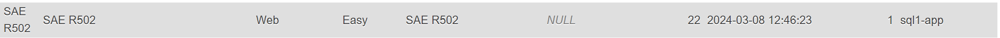

# Projet SAE R502 - Automatisation de Tâches

Ce projet vise à automatiser certaines tâches liées à la gestion des conteneurs Docker sur une machine VPS distante pour le Site d'apprentissage en ligne dédié à la cybersécurité ERREUR502. L'objectif principal est de récupérer le nombre d'images Docker disponibles sur un autre VPS.

Ce dépôt GitHub contient l'ensemble du projet, comprenant l'API, les fichiers Dockerfile, ainsi qu'une partie Ansible pour faciliter la configuration côté administrateur.

## Fonctionnalités

- Conteneurisation de l'API : L'API est conteneurisée pour faciliter le déploiement et l'isolation.
- Récupération du nombre d'images Docker : L'API permet de récupérer le nombre d'images Docker disponibles sur la machine VPS distante où tournent les conteneurs.
- Interface Web Symfony : Une interface utilisateur est créée avec Symfony, incluant un formulaire pour insérer le nom de l'image associée à un challenge.

## Configuration Requise

- Docker
- Symfony
- Ansible

## Installation et Utilisation

1. Cloner le dépôt GitHub :

```
git clone https://github.com/dufourtheo/SAE-R502.git
```


## Captures d'écran

- 
- 

## Auteur

Ce projet a été réalisé par [DUFOUR THEO](https://github.com/dufourtheo).

## Licence

Ce projet est en lien avec Hackcess